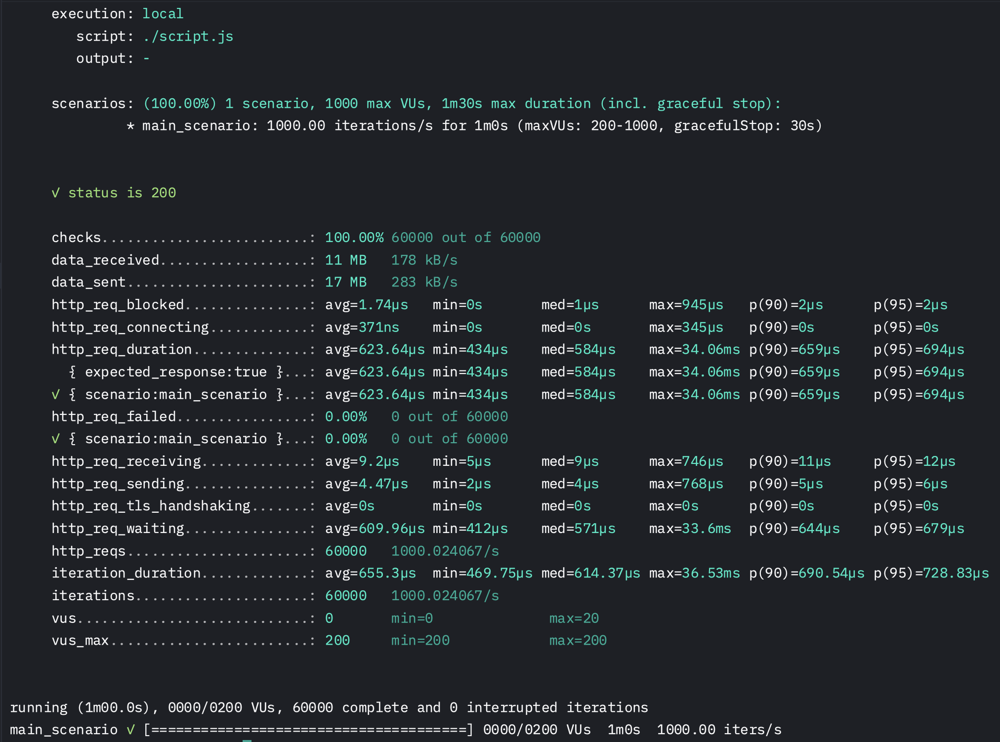

# Корпоративный магазин

## Структура проекта:

- /cmd/main.go – точка входа.
- /e2e_test/e2e_scenario_test.go - тест для запущенного приложения в контейнере по всем 4 эндпоинтам.
- /internal
  - config/ – конфигурация приложения.
  - db/ - сгенерированный код для работы с БД. (sqlc)
  - handlers/ – HTTP-обработчики для API.
  - middleware/ – JWT-аутентификация.
  - repository/ – работа с базой данных.
  - service/ – бизнес-логика. (На этом уровне реализованы транзакции)
  - sql/queries - запросы к базе данных.
  - sql/schema - схема базы данных и миграции.
  - utils/ - функции для работы с JSON-ответами, немного переделанный логгер, обогащение БД.
- /load_test/script.js - скрипт для нагрузочного тестирования k6.

## Работа с проектом:

- Скачать проект `git clone https://github.com/par1ram/merch-store.git`
- Запустить проект в докере `docker-compose up --build`

#### Для проведения e2e теста по 4 эндпоинтам с реальным приложением и БД:

- Необходимо запустить контейнер
- Ввести в терминал: `go test ./e2e_test -v`

#### Если нужно запустить проект без докера:

- Настройте .env файл
- Введите в терминал `air`
- Запустить все тесты: `go test ./... -cover`

## Результат нагрузочного тестирования

#### Ключевые показатели

✅ Все запросы успешны (status is 200)

- 100% успешных запросов (60000 / 60000).
- Ошибок нет (http_req_failed: 0.00%).

✅ Достигнута запрашиваемая нагрузка (RPS = 1000)

- Реальный RPS = 1000.02 → точное выполнение цели 1000 запросов/с.

✅ Время ответа (http_req_duration: avg=623.64µs)

- Среднее время ответа = 0.62 мс → намного быстрее 50 мс.
- Максимальное время ответа = 34.06 мс → почти в 1.5 раза меньше лимита (50 мс).
- p(95) = 694 мкс → 95% запросов обрабатываются быстрее 0.7 мс.

✅ Время ожидания ответа (http_req_waiting: avg=609.96µs)

- Сервер обрабатывает запрос среднее за 0.61 мс перед отправкой ответа.
- Максимум 33.6 мс, что значительно ниже порога 50 мс.

✅ Минимальные задержки соединения (http_req_blocked, http_req_connecting)

- http_req_blocked: avg=1.74µs → время ожидания сетевого соединения мгновенное.
- http_req_connecting: avg=371ns → соединение устанавливается почти моментально

✅ Эффективное использование ресурсов

- vus_max: 200 → используем ровно 200 виртуальных пользователей (VUs), что достаточно для нагрузки.
- Нет dropped iterations, все 60000 итераций успешно выполнены.

### Вывод

- ✅ API выдерживает 1000 RPS стабильно.
- ✅ Все 60000 запросов обработаны без ошибок.
- ✅ Сервер отвечает быстрее 50 мс (p95 = 0.7 мс).
